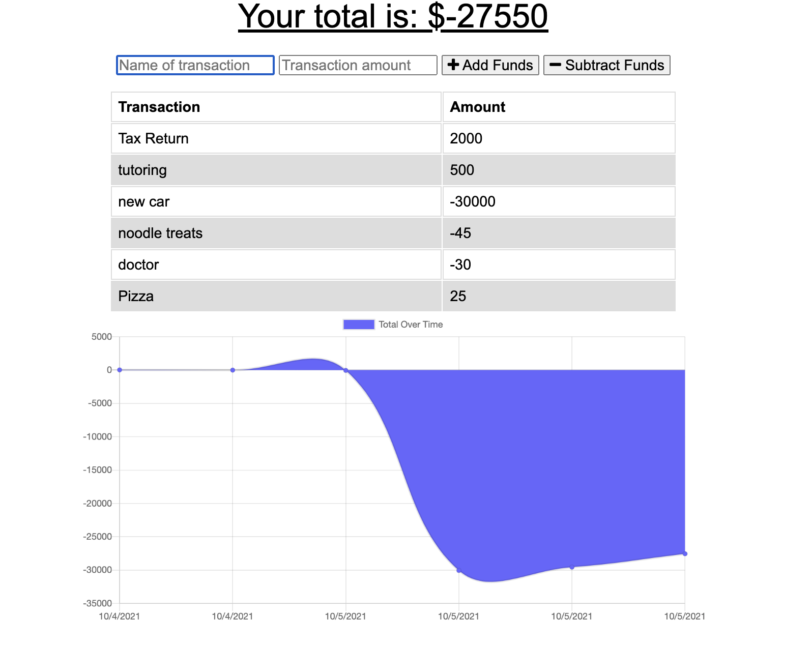

# Budget-Tracker-HW 

## Description

A user can keep track of their budget by 'adding funds' or 'subtracting funds.' The functionality works when a user is offline, as well.

## Table of Contents

- [Usage](#usage)
- [Assets](#assets)
- [License](#license)
- [GitHub Profile](#github-profile)
- [Contact by Email](#email)

## Usage

Type the title of the transaction, along with the amount. Then click the respective button for whether the amount should be added or subtracted from the budget.

## Assets

## License

This project is licensed with MIT.

### GitHub Profile

[My Profile](https://github.com/audrey-g37)

### Email

audrey.gillies@gmail.com
